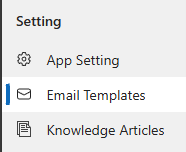
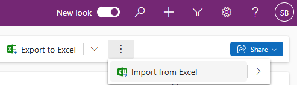
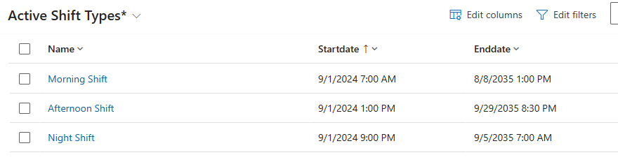
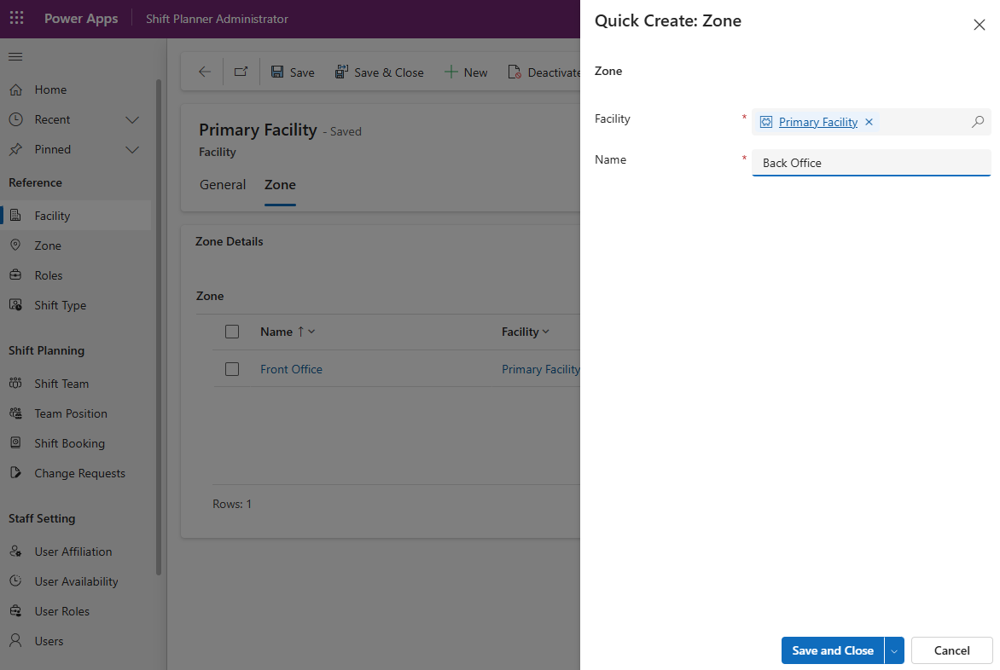
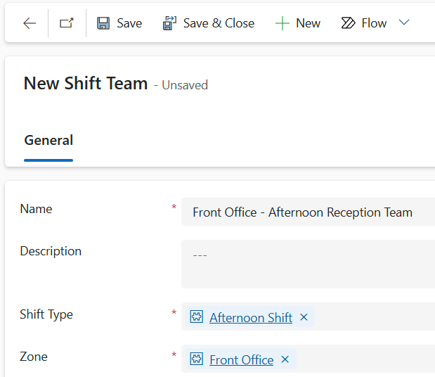
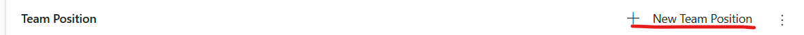
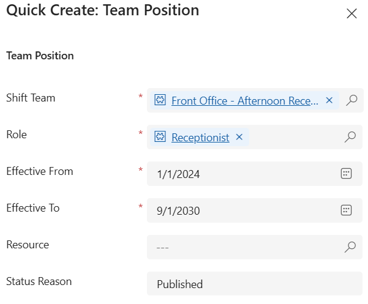
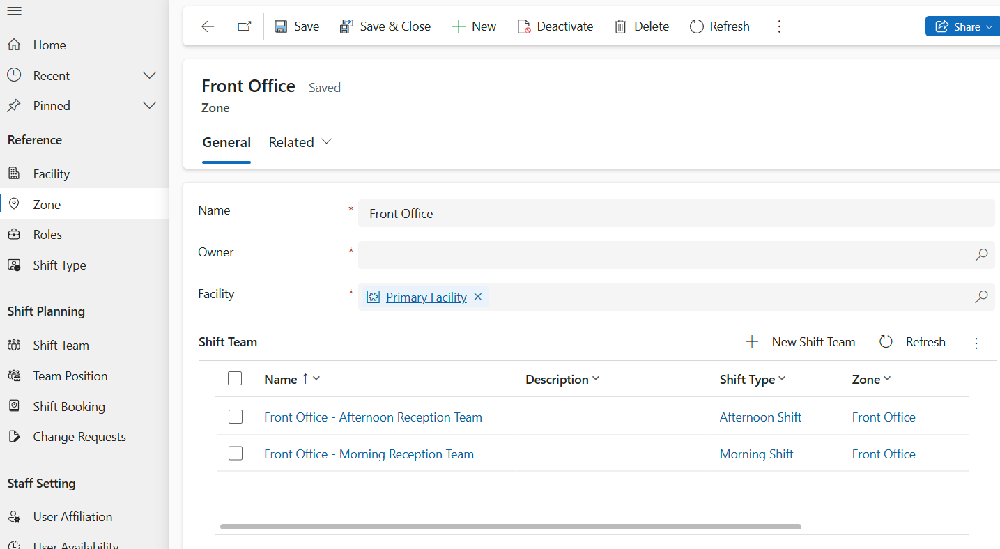
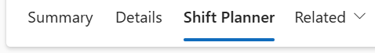
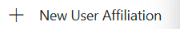

# Shift Planner Getting Started Guide
This document describes the process of configuring and using the Shift Planner Power Platform Template for your team or organisation.

This involves the following Parts:
1. Loading **Email Templates** for communications the system will perform
2. Establishing the unique **Roles** that users will perform E.g. 
3. Setting up the **Shift Types** that you will staff E.g. Morning Shift, Afternoon Shift, Night Shift
4. Setting up **Facilities** for which you will roster E.g. Main site
5. Setting up **Shift Teams** which organise staff into teams for better management, allowing for team-based shift assignments.
6. Setting up **Users** ready for scheduling

## Load Reference Data
The first step is to load reference data into the system. 

### Part 1: Email Templates
1. Download the email templates from [here](Default-Email-Templates.xlsx)
2. Navigate to [make.powerapps.com](https://make.powerapps.com/)
3. Click on **Apps** in the left navigation
4. Click on the play button next to **Shift Planner Administrator** to play the app
> [!NOTE]
> If the play button is disabled or not visible, you need to publish all customisations. Navigate to **Solution** in the left navigation and press the **Publish all customisations** button. Once this is complete, the playu button should be visible
5. Click on the **Email Templates** left menu option
> 
6. From the toolbar, click on the Import From Excel button
> 
7. Select the file you downloaded from [here](Default-Email-Templates.xlsx)
8. Click **Next**
9. Click **Finish Import**
10. Click **Track Progress** and monitor the import using the Refresh button on the toolbar. When 15 records are successfully loaded, the import is complete
11. You can navigate back to the **Email Templates** menu option and edit any email templates to suit your organisation.

### Part 2: Setup Roles
Roles are the distinct functions users are qualified and/or authorised to perform (e.g. a triage nurse or receptionist). To setup the roles, perform the following steps.

1. From the **Shift Planner Administrator** App, navigate to **Roles**
2. Click **New** to create a new Role, populate the Name and Description, then press **Save**
3. Repeat step 2 for each new Role
   
### Part 3: Setup Shift Types
Shift types classify the various types of shifts, such as morning, evening, and night shifts. These classifications aid in the organization and assignment of shifts based on specific time slots and requirements.

1. From the **Shift Planner Administrator** App, navigate to **Shift Types**
2. Click **New** to create a new Shift Type, populate the Name, Start Date, and End Date then click **Save**
> [!NOTE]
> Start Date consists of a Date component and a Time component. The date component is the first date from which the shift will become available for scheduling. The Time component is the time of day that the shift will start.
> End Date consists of a Date component and a Time component. The date component is the last date on which the shift will be available for scheduling. The Time component is the time of day that the shift will end.
4. Repeat step 2 for each new Role
> Here is an example of shifts covering a 24 hour period
> 

### Part 4: Setting up Facilities
Facilities are the the primary grouping for locations to which will plan shifts for. Each facility is divided into Zones. Shifts occur at the Zone level. To setup the facilities, perform the following steps.

1. From the **Shift Planner Administrator** App, navigate to **Facility**
2. Click **New** to create a new Facility, populate the Name and Description, then press **Save**
3. Click on the **Zone** tab of the newly created facility
4. For each zone you plan to roster for, click the  **+New Zone** button, populate the name and click **Save**

5. Repeat steps 2-4 for each facility you wish to create

### Part 5: Setup Shift Teams
Shift Teams are how staff are grouped together. They are associated to a particular Zone and Shift Type. To setup the roles, perform the following steps.

1. From the **Shift Planner Administrator** App, navigate to **Shift Team**
2. Click **New** to create a new Shift Team, populate the Name and Description, specify a Shift Type and Zone, then press **Save**

3. For each position within the team, click **+New Position** to add a position

4. Populate the quick create form by specifying the Role, Effective From and Effective To dates. You can optionally specify a standard Resource for the role. Then press **Save and Close**

5. Repeat steps 2-4 for each Shift Team
> [!NOTE]
> You can also create a Shift Team from the details screen for a **Zone**
> 

### Part 7: Setting up Users
1. From the **Shift Planner Administrator** App, select the **Users** menu option
2. Select the User record to setup
3. Click the **Shift Planner** tab on the User form

4. Setup the Zones to which this User is affiliated (i.e. available for scheduling) by clicking the  button and populating the Facility and Zone to associate them with. Then click the **Save and Close** button.
5. Repeat step 4 for each zone 
6. Setup the Roles to which this User is authorised to perform by clicking the 
 button to display the Quick Create form. Populate the Resource and Role fields. Then click the **Save and Close** button.
5. Repeat step 6 for each Role the user can perform.