# Shift Planner Installation Guide
This document lists out the 

## Initial Installation

### Prepare Connectors
The following connections must be created prior to importing the solution:
- Microsoft Dataverse
- Office 365 Outlook
- Approvals
- Content Conversion
> [!NOTE]
> Note: We recommend using a system account to create the connections and import the solution, although this is not required.

Any user with the **System Administrator** security role can perform the following steps:
1. Go to the Power Apps portal https://make.powerapps.com/
2. Click on the **Environments** tab and select the environment where the solution will be installed.
3. Using the left navigation, click on **More**, **Connections,**

then click on **New connection.**

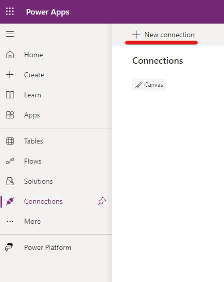

5. For each of the following four connectors **Microsoft Dataverse**, **Office 365 Outlook**, **Approval** and **Content Conversion**.
6. Click on **Create.** This step will create a new connection with the logged-in user's credentials.

## Importing the solution into the new system
1. Go to https://make.powerapps.com/.
2. Go to the environment where you want to install the solution.
3. Click on Solution from the left navigation.
4. Click import Solution from the top of the screen.

5. Import solution screen will appear.

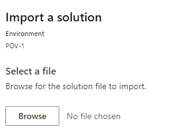

6. Click browse and open **mpa_ShiftPlanner_X_X_X_X.zip** (unmanaged) or
**mpa_ShiftPlanner_X_X_X_X_managed.zip** for managed solution. The latest version is available from https://github.com/microsoft/shiftplanner/releases
7. Click Next.
8. Validate the detail and click on Import Button

9. Verify that the tables exist as shown in the image below.

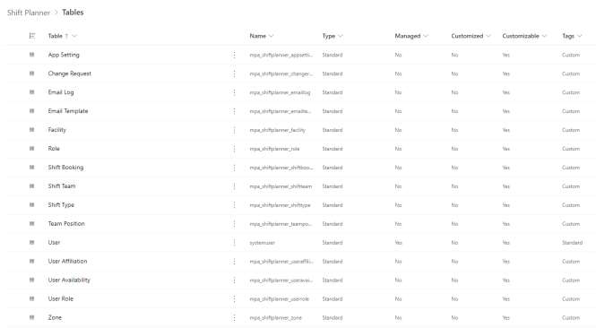

### Assign Security Roles to the Users
The solution includes three (3) new security roles described in the **Security Role Descriptions** section above.

Assign **Shift Planner End User** to users who need access to the Mobile Canvas app to view their assigned shifts
and to request for time-off or swap shifts.

Assign **Shift Planner Shift Admin** to users who will need access to the Desktop Canvas app to configure their
shift’s schedule and team.

Assign **Shift Planner Admin** to users who will manage the data within the Model-driven app, including creating,
updating facilities, zones, shift types, roles, and email templates for the management of the shift schedule.

Roles can be assigned from the admin portal using the following steps:
1. Go to the admin portal https://admin.powerplatform.microsoft.com/
2. Click on the **Environment** tab and select the environment where the solution was installed.

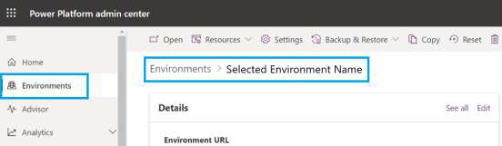

3. Click on Users > See all
4. Select the user(s), click **Manage security roles,** and select the appropriate role.

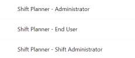

5. Click Save
6. Publish the canvas application.

### To publish the canvas application:
1. Go to the power apps portal https://make.powerapps.com/
2. Click on the **Environments** tab and select the environment where the solution was installed.
3. Click on **Solutions** in the left navigation, find the **Shift Planner** solution under the managed/unmanaged (depending on the type of solution installed) tab, then click the **Apps** in the navigation and select **Shift
Planner.**

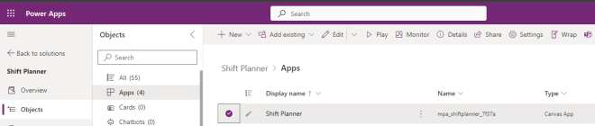

5. Click on the three dots and click on Share.
6. Look for the user(s) that you want to share the app with:
	- For users that should have access to edit the app, check the **Co-owner** box.
	- For regular users of the app, leave that checkbox empty.
	- If everyone in the company should be able to use the app, you can look for **Everyone** in the **Enter a name** box.
	
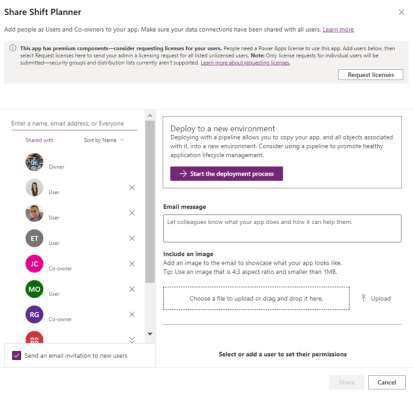

5. When you’re done, click **Save**.
6. Publish the App.

## Initial Configuration
The canvas applications feed the data on Dataverse and need the environment variables set up to work. There are also flows that run as part of the applications’ functionalities and capabilities. Please ensure these flows are turned on before using the applications.

### Set the environment variables
The solution includes two (2) environment variables that must be filled in first:
- Mobile App Link – The link to the Shift Planner mobile app when played
- Shared Calendar Name – Name of user’s regular calendar (the default name is **Calendar**)

To get the Shift Planner mobile app link environment variable:
-  On the left navigation, go to **Apps**. Look for the **Roster** or **Shift Planner Mobile app**, click on the 3 dots next to the name, and select Details.

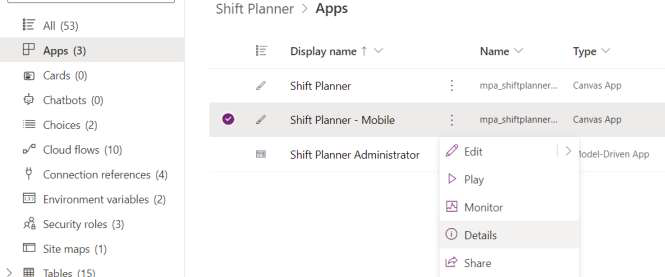
 
- You can find the Shift Planner Mobile app link under Web Link and copy it.
- Go to the **Solutions** screen and select the **Default Solution**
- Go to **Environment variables** section and click on **Mobile App Link** to open it.

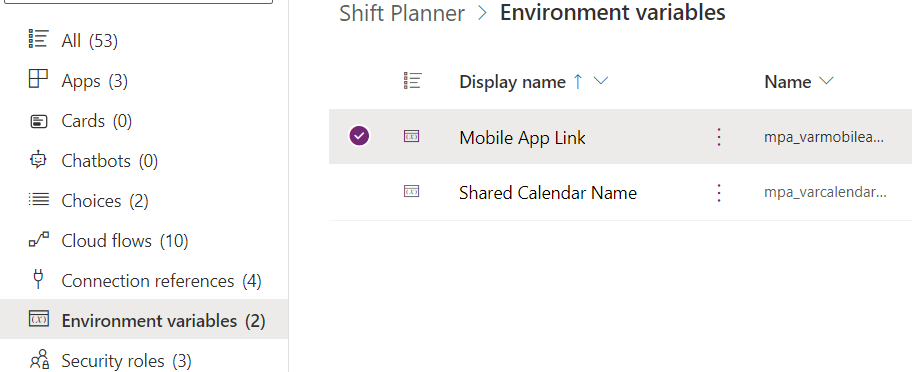
 
- Then paste your mobile app link under Current Value and click save.

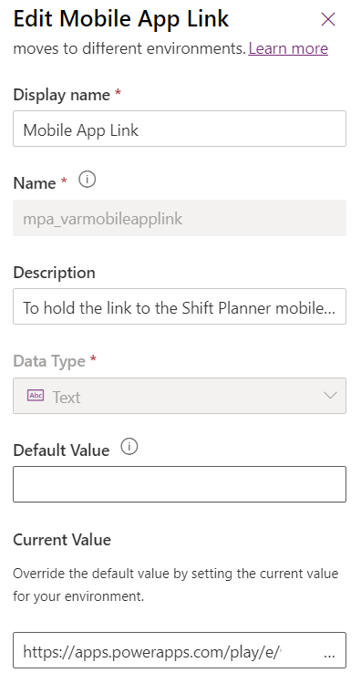

### Validate the Cloud Flows are turned on
Now that environment variables are setup, you need to make sure all the cloud flows are turned on by following the below steps:

1. Navigate to make.powerapps.com
2. Navigate to Solutions --> Shift Planner --> Cloud flows
3. See if any cloud flows are turned off by looking at the values in the Status column
> 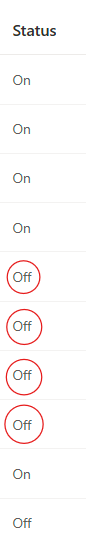
4. For any flow in status off, click triple dots --> details --> details in new tab
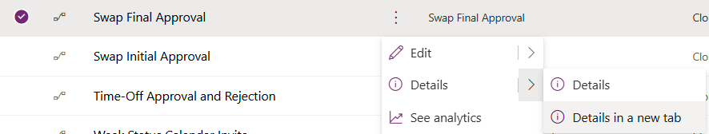
5. In the newly opened browser window, click the Turn On button from the toolbar
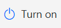

> [!NOTE]
> If you receive an error such as "Workflow cannot be used as a child workflow because child workflows only support embedded connections", it is caused by the child workflow not having a run only connection set.
>
> To Fix this error:
> 
> a. Navigate to the detail screen of the **child** workflow.
> 
> b. Click on the edit button in the Run Only users box
> 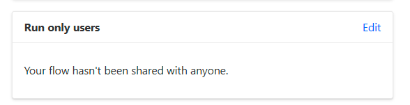
> 
> c. Ensure each box has a "use this connection" set
> 
> d. Click Save, and attempt to turn the parent workflow on. 

### Populate the reference data
To configure the application and populate the necessary reference data, open your environment and go to your model-driven app labeled **Shift Planner Administrator**, refer to the [Getting Started Guide](getting-started.md) for details

